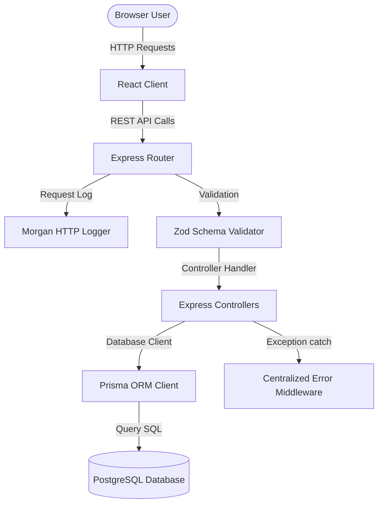

# System Architecture Document

This document describes the architectural layout, technology modules, database interactions, and verification procedures for the Mini ERP + CRM Operations Portal.

---

## 1. Monorepo Organization

The project is split into two independent services:
- **`client/` (Frontend)**: React application scaffolded using Vite. Deploys to static hosting sites (Vite output is in `dist/`).
- **`server/` (Backend)**: Node.js Express server using strict TypeScript. Compiles to ES2022 JavaScript (output is in `dist/`).

This separation ensures that frontend and backend can run and scale independently, and can be easily deployed to Vercel and Render respectively.

---

## 2. Core Modules Flow

---

## 3. Technology Stack & Key Layers

### Strict Type Validation & Contracts
- **TypeScript**: The backend requires strict compilation. This guarantees code safety and API contract integrity across all database routes.
- **Zod**: Validates input data payloads (request bodies, query params, path variables) before controllers process them. It acts as an execution boundary.

### Database connectivity (Prisma + PostgreSQL)
- **Prisma Client**: An auto-generated query builder tailored to the models defined in `prisma/schema.prisma`.
- **Database**: PostgreSQL (accessible via `DATABASE_URL` environment variables). Support for local database setups and cloud hosting (Neon, Supabase) is included.

### Logging & Diagnostics
- **Morgan Logger**: Express request-logging middleware format `dev` logs standard methods, status response codes, and request durations during active development.
- **Health Check Endpoint**: Mounts on `GET /api/health` and provides a quick JSON report indicating system time, node env, and uptime checks.

---

## 4. Route Manifest

| Method | Endpoint | Description | Expected Payload | Response |
| :--- | :--- | :--- | :--- | :--- |
| **GET** | `/api/health` | Health Check Endpoint | None | System status, app name, timestamp, node env |
